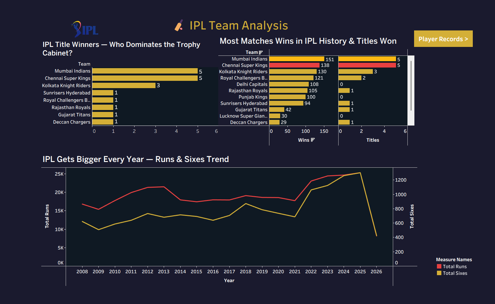
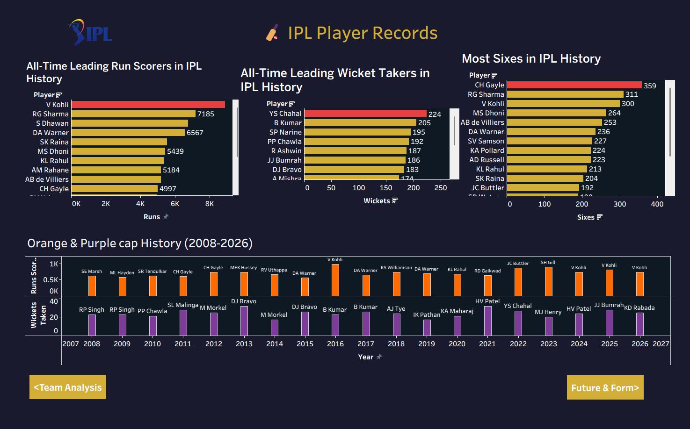
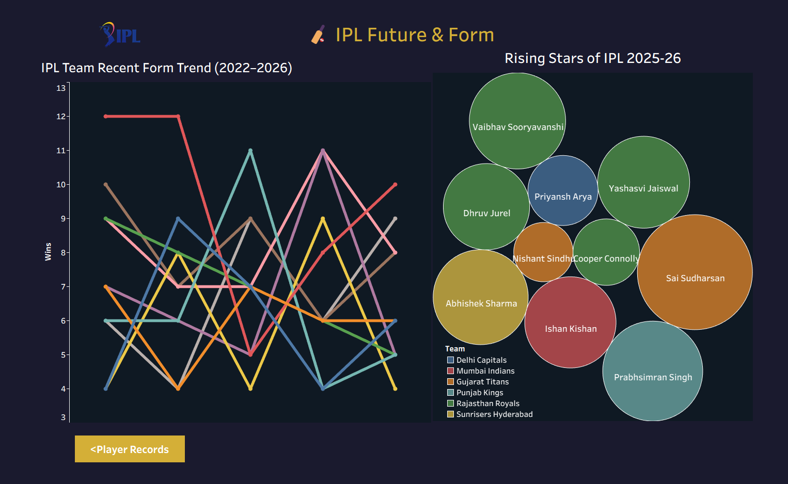

# 🏏 IPL Cricket Analytics Dashboard (2008–2026)

An interactive multi-page Tableau dashboard analyzing 19 seasons 
of IPL data — covering team dominance, player records, and the 
next generation of cricket stars.

🔗 **[View Live Dashboard on Tableau Public](https://public.tableau.com/views/IPLDATASETFINAL/FutureForm)**

---

## 📊 Dashboard Overview

### Dashboard 1 — Team Analysis
- IPL Title Winners (2008–2026)
- Most Matches Won by Team
- Season Trends — Runs & Sixes over the years

### Dashboard 2 — Player Records
- All-Time Top Run Scorers
- All-Time Top Wicket Takers
- Most Sixes in IPL History
- Orange & Purple Cap History (2008–2026)

### Dashboard 3 — Future & Form
- Team Recent Form Trend (2022–2026)
- Rising Stars of IPL 2025–26 (Packed Bubble Chart)

---

## 🔍 Key Insights

| Insight | Detail |
|---------|--------|
| Most Dominant Team | Mumbai Indians — 5 titles, 151 wins |
| Top Run Scorer | Virat Kohli — 8000+ runs |
| Top Wicket Taker | YS Chahal — 224 wickets |
| Most Sixes | CH Gayle — 359 sixes |
| Rising Star | Vaibhav Sooryavanshi — 1028 runs, age 14 |

---

## 🛠 Tools Used

- **Tableau Public** — Dashboard design & visualization
- **Microsoft Excel** — Data cleaning & preparation
- **Data Source** — Kaggle IPL Dataset 2008–2026

---

## 📁 Files in this Repository

| File | Description |
|------|-------------|
| `IPL_Dashboard_Salim_Arshad.twbx` | Tableau Packaged Workbook |
| `IPL_Master_Dataset updated.xlsx` | Cleaned Excel Dataset |
| `dashboard1-team-analysis.png` | Dashboard 1 Screenshot |
| `dashboard2-player-records.png` | Dashboard 2 Screenshot |
| `dashboard3-future-form.png` | Dashboard 3 Screenshot |

---

## 📸 Dashboard Preview

### Team Analysis

### Player Records

### Future & Form

---

## 👤 Author

**Salim Arshad**  
Billing & Operations Associate → Aspiring Data Analyst  
📍 Kolkata, India

🔗 [Tableau Public Profile](https://public.tableau.com/app/profile/salim.arshad)  
🔗 [GitHub](https://github.com/salimarshad07)  
🔗 [LinkedIn](https://linkedin.com/in/your-linkedin)

---

*Source: Kaggle IPL Dataset 2008–2026 | Built with Tableau Public*# opl-analytics-dashboard
Interactive IPL Cricket Analytics Dashboard (2008-2026) built with Tableau Public
